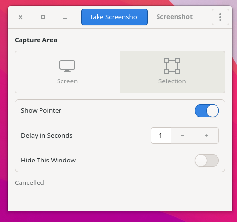

# gtk-wl-capture

A small GTK4 screenshot tool for Wayland that does not care which desktop you
run. Full screen or rubber-band selection, optional delay and pointer, save
and/or copy to the clipboard.

Capture goes through `zwlr_screencopy_unstable_v1` on wlroots-family
compositors (Sway, Wayfire, Hyprland, river, ...) and falls back to
`org.freedesktop.portal.Screenshot` over D-Bus on GNOME and KDE. Clipboard
copying uses `wl-copy` when it is installed, so the image survives the app
exiting.

## Usage

    gtk-wl-capture              open the window
    gtk-wl-capture --shot FILE  capture every output to FILE and exit

Shortcuts: `Ctrl+N` capture, `Ctrl+C` copy, `Ctrl+S` save, `Ctrl+Shift+S` save
as, `Ctrl+,` preferences, `Ctrl+Q` quit, `Esc` cancels a selection.

Settings live in `~/.config/gtk-wl-capture/config.json`.

## Build and run

Needs Nim (>= 2.0) with nimble, GTK 4, and the Wayland client library plus
`wayland-scanner` for the protocol glue.

    # Fedora
    sudo dnf install nim gtk4-devel wayland-devel wayland-protocols-devel wlr-protocols
    # Debian/Ubuntu
    sudo apt install nim gtk-4-dev libwayland-dev wayland-protocols

    nimble build      # generates the protocol glue on first run
    ./gtk-wl-capture

Optional but recommended at runtime: `wl-clipboard`.

Tests:

    nimble test

## Packages

    packaging/build-packages.sh

Builds an `.rpm` and a `.deb` into `dist/` from the same staged tree. Needs
`rpmbuild` for the rpm; the deb is assembled with `ar` and `tar`.

## Install without a package

    nimble build
    sudo PREFIX=/usr/local nimble stage

## License

MIT, see [LICENSE](LICENSE). The two symbolic action icons are Bootstrap Icons,
also MIT - see [data/icons/LICENSE](data/icons/LICENSE).
